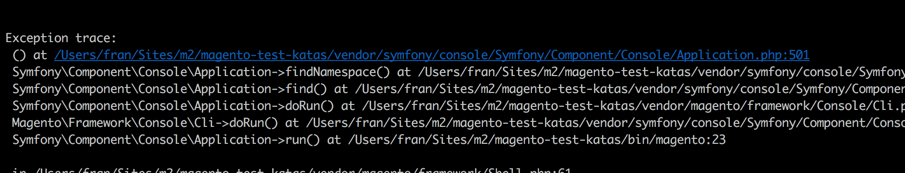
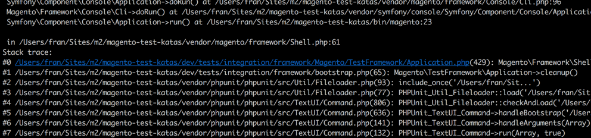
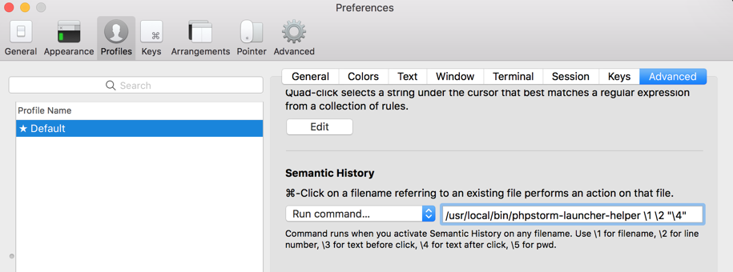
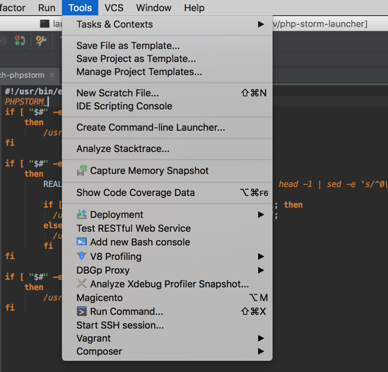
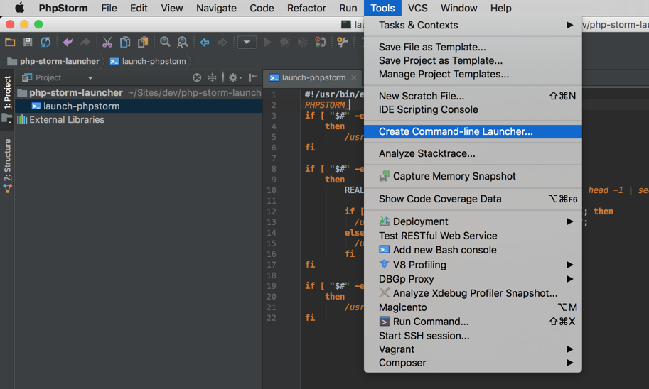
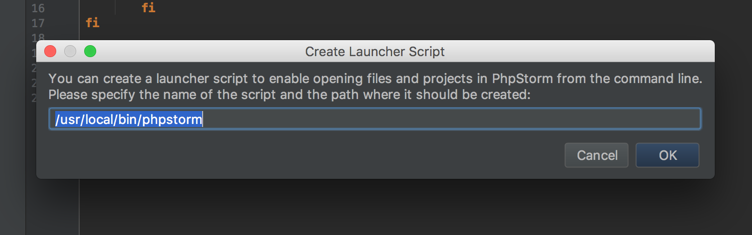

# iTerm2 PHPStorm Helper

Simple and easy `CMD + Click` to open php files at the right line number :white_check_mark:
This is a bash script to help iTerm2 translate php output line numbers correctly when opening in PHPStorm.
Feel free to sent any improvements and changes my way.

## Examples 





## Caveats

I have only tested the script on a Mac, please report if successful on other platforms :shipit:

## Installation
```bash

wget https://raw.githubusercontent.com/rootindex/iterm2-phpstorm-helper/master/phpstorm-launcher-helper \
    -O /usr/local/bin/phpstorm-launcher-helper \
    && chmod +x /usr/local/bin/phpstorm-launcher-helper
    
```

## Configuration

In iTerm2 you just need to change the launcher to a run command as follows:


If you have not setup a cli launch command for phpstorm follow these steps: 




## Credit

Francois Raubenheimer